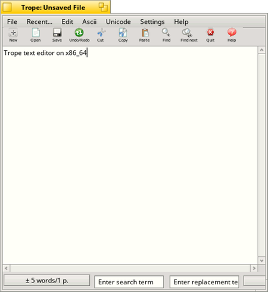

# Trope

by Michel Clasquin-Johnson

Trope is a text editor with easy access to high-ASCII and some Unicode characters. It also serves as the basis for other, more specilised text editors.

Written in yab using the Yabadabbadoo IDE

Public Domain software

Get it here: https://github.com/clasqm/Trope

Binaries: https://sourceforge.net/p/tropeforhaiku/
